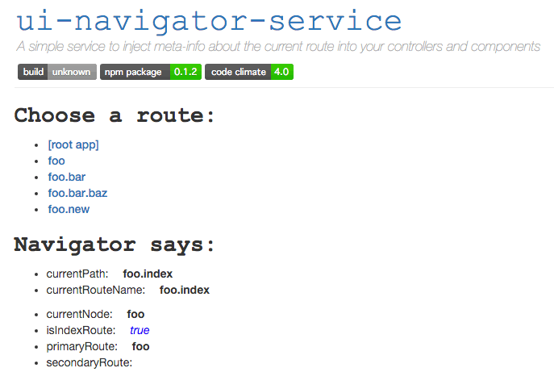

# ui-navigator-service
> inject _meta-info_ about the current route into your controllers and components

## Screenshot




## Demo

Check out the demo app to see it in action: [demo app](https://ui-navigator-service.firebaseapp.com)

## Installation

Assumes Ember CLI > 0.2.3

````bash
ember install ui-navigator-service
````

## Usage

By default this add-on will now inject itself into all Routes, Views, and Components as `navigator`. If you wish to override this behavior you can configure this in your `config/environment.js` file. If, for instance, you wanted to have _only_ Components get the service injected automatically, you would add the following:

````javascript
module.exports = function(environment) {
  var ENV = {
    uiNavigator: {
      injectionFactories: [ 'component' ]
    }
  }
}
````

But that doesn't prevent you from adding the service on an ad-hoc basis to other factories. Here's how you might add to a particular route where you wanted the service available:

````javascript
export default Ember.Route.extend({
  navigator: Ember.service.inject(),
  // ...
});
````

> **Note:** the reason that _controllers_ were not included as a default injection was that you would have the service injected into the `application` controller which would create a race condition.
